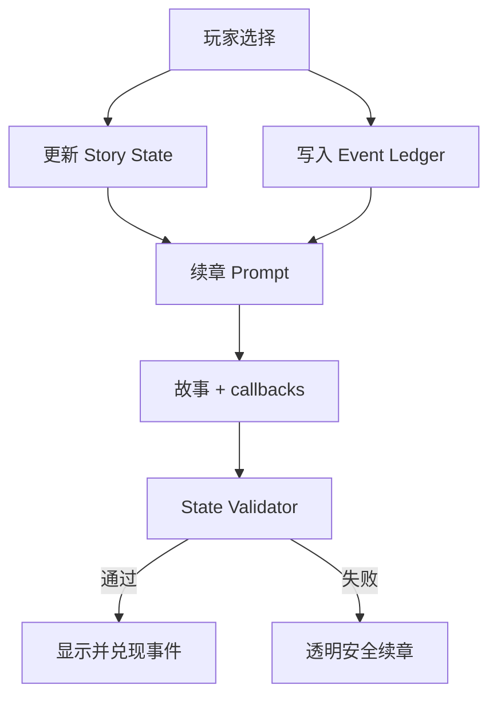

# Story Generation V4：因果状态、生成反馈与章节插图

## 验收目标

| 目标 | 实现 | 可观察验收 |
|---|---|---|
| 每个选择绑定 2–3 个 story variables | `StoryChoice.effects`，维度为 `career / economy / relationship / selfFulfillment` | 任一 AI 选择的 `effects.length` 为 2–3 |
| 后文记住前面的选择 | 选择写入 `StoryState` 与 `StoryEvent`；续章收到完整 `StoryBible + StoryState + eventLedger + choices` | 后续章节至少返回 1 个 pending `eventId` 的 callback |
| 后果必须明确出现 | `State Validator` 要求 callback 的 `evidence` 原样存在于本章正文或 outcome，逾期事件不得遗漏 | AI 结果未通过时不展示，改用带明确标记的因果安全续章 |
| 分支缓存不串线 | 章末有选择时，选完才预生成；缓存同时校验 `finalNodeId + stateVersion` | 回溯换选项后不会使用旧分支章节 |
| 用户知道 AI 是否成功 | `/prepare` 显示生成、校验、ready、fallback、failed；fallback 显示原因 | 断开模型后明确显示安全模板，不冒充 AI 结果 |
| 插图跟随实时情节和所选立绘 | 自定义故事每章调用 Wan 2.7，输入为所选立绘 Base64 + 本章场景 | 图注显示 AI 实时章节插图；失败时显示所选立绘而非固定角色图 |

## 数据流



### Story State

四个维度保存当前已经成立的事实，而非抽象分数：

- `career`：职业路线、岗位、项目或已关闭的机会。
- `economy`：收入、储备、支持安排与风险期限。
- `relationship`：重要关系、承诺、冲突与边界。
- `selfFulfillment`：自主感、价值目标、身心余量与满足方式。

数值型五维 `deltas` 继续用于章末回望；Story State 用于生成事实，两者职责不同。

### Event Ledger

每次选择产生一个事件，记录来源节点、选择、2–3 个 effects、预期后果、最迟兑现章节和状态。续章必须返回：

```json
{
  "callbacks": [
    {
      "eventId": "原始事件 ID",
      "evidence": "从本章正文或选项 outcome 原样复制的证据"
    }
  ]
}
```

Validator 会拒绝不存在的事件、重复事件、正文中找不到的证据，以及到期仍未兑现的事件。模型只改变了引号、标点或空格时会先做归一化匹配；高相似度的轻微改写会对齐回正文中的真实句子，低相似度内容仍被拒绝。

## 生成状态

`/prepare` 只展示系统真实知道的阶段，不模拟百分比：

1. `generating`：请求仍在等待模型返回。
2. `validating`：响应已到达，客户端正在核对并保存结构化结果。
3. `ready`：AI 故事可进入。
4. `fallback`：AI 未配置或没有通过结构/因果检查，已明确切换安全模板。
5. `failed`：请求本身未完成，保留角色卡并提供重试。

所有严格 JSON 生成显式设置 `enable_thinking=false`，避免把请求预算消耗在用户不可见的思考内容上。首章与续章均使用流式响应，避免长文本生成期间上游连接因空闲而中断。首章最多两次 75 秒尝试，输出上限 4500 tokens，只返回五章简要大纲与一个可玩的关键决策场景；后续章节最多三次 90 秒尝试并恢复完整叙事密度。JSON 语法或结构失败后的重试会降低温度并继续保持 JSON 模式。所有调用预算都为 Vercel 响应与安全模板保留余量；最终仍失败时，服务端按当前 Story State、上一选择和待兑现事件构造透明标记的安全续章，玩家不会卡在章末。

## 插图策略

- 预设故事：继续使用经过审核的仓库内置插图。
- 自定义故事：每章生成一张关键场景图，同章节点复用，控制费用和人物一致性。
- 输入：用户选中的固定立绘（服务端读取并转为 Base64）+ 角色名 + 章节标题 + 场景标题 + 当前正文。
- 模型：`WAN_IMAGE_MODEL`，默认 `wan2.7-image-pro`。
- 失败：界面使用用户所选立绘，并明确显示“AI 插图生成失败”；不再回退到林澈场景图。
- 生命周期：Wan 返回 URL 约 24 小时有效；当前访客存档同样 24 小时，代码按 23 小时标记过期并可重新生成。生产长期存档应把图片转存对象存储。

## 本地验证

```bash
pnpm lint
pnpm build
```

完整模拟链路：

```bash
node scripts/mock-dashscope.mjs
LLM_BASE_URL=http://127.0.0.1:8787/v1 \
DASHSCOPE_IMAGE_ENDPOINT=http://127.0.0.1:8787/api/v1/services/aigc/multimodal-generation/generation \
DASHSCOPE_API_KEY=mock pnpm dev
node scripts/e2e-llm.mjs
```

## 失败验收矩阵

| 场景 | 期望结果 |
|---|---|
| 未配置 `DASHSCOPE_API_KEY` | 首章使用安全模板，页面显示 fallback 与原因 |
| 文本模型超时或 JSON 不合法 | 首章和续章都透明降级，不产生 Vercel 504，也不阻断下一章 |
| callback ID 不在账本 | AI 结果不展示，返回带原因提示的安全续章 |
| callback evidence 不在正文 | AI 结果不展示，返回带原因提示的安全续章 |
| 逾期事件未 callback | AI 结果不展示，安全续章按账本补齐到期 callback |
| 章末选择前停留 | 不启动下一章预生成 |
| 回溯后选择另一项 | 截断旧的自定义未来章节，重建 state/ledger 后重新生成 |
| Wan 未配置、超时或响应无图片 | 故事继续可玩，显示所选立绘及失败图注 |
